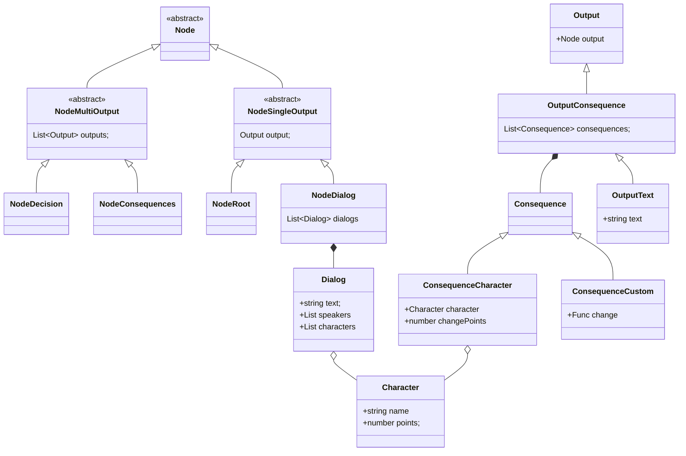

# fiesta-uwu-third-try

## Architecture

### Classes

#### Data

```mermaid
classDiagram
    class Node {
        <<abstract>>
    }

    Node <|-- NodeMultiOutput
    class NodeMultiOutput {
        <<abstract>>
        List~Output~ outputs;
    }

    NodeMultiOutput <|-- NodeDecision
    class NodeDecision {
    }

    NodeMultiOutput <|-- NodeConsequences
    class NodeConsequences {
    }

    Node <|-- NodeSingleOutput
    class NodeSingleOutput {
        <<abstract>>
        Output output;
    }

    NodeSingleOutput <|-- NodeRoot
    class NodeRoot {

    }

    NodeDialog *-- Dialog
    class Dialog {
        +string text;
        +List<Character> speakers
        +List<Character> characters
    }

    NodeSingleOutput <|-- NodeDialog
    class NodeDialog {
        List~Dialog~ dialogs
    }

    %% NodeSingleOutput *-- Output
    %% NodeMultiOutput *-- Output
    class Output {
        +Node output
    }

    Dialog o-- Character
    ConsequenceCharacter o-- Character
    class Character {
        +string name
        +number points;
    }

    OutputConsequence *-- Consequence
    class Consequence {

    }

    Consequence <|-- ConsequenceCharacter
    class ConsequenceCharacter {
        +Character character
        +number changePoints
    }

    Consequence <|-- ConsequenceCustom
    class ConsequenceCustom {
        +Func change
    }

    Output <|-- OutputConsequence
    class OutputConsequence {
        List~Consequence~ consequences;
    } 

    OutputConsequence <|-- OutputText
    class OutputText {
        +string text
    }
```

### 
